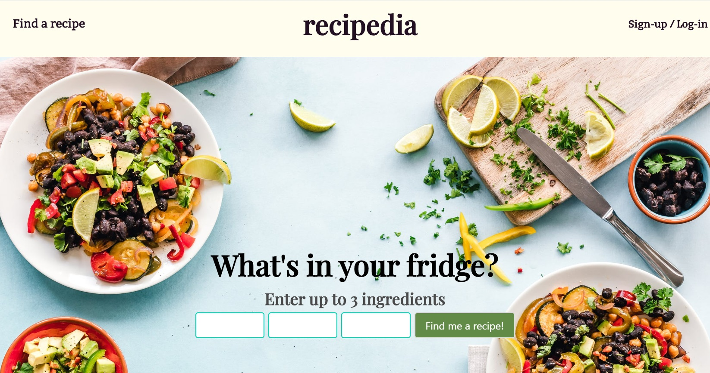

### General Assembly, Software Engineering Immersive

# project-4

## Recipedia
by [Emma Hobday](https://emmahobday.github.io/) and [Denise Cheung](https://denisecheung3.github.io/).

Fridge half-full and need inspiration? Recipedia lets users input ingredients they've got and suggests recipes for them. You can browse, search and filter recipes using a range of advanced search features and, if you find something you like, add it to your personal meal planner. If you're missing any ingredients, add them to your personal shopping list and check them off once you've got them. Rate recipies out of five, and you'll receive personalised recipe suggestions based on your tastes.

Check it out here.

This is my fourth and final project with General Assembly's Software Engineering Immersive course. This was a paired project, completed in one week. All the project planning was collaborative - we came up with a really detailed plan that we both felt very excited about. We pair-programmed the first day, setting up project from scratch and designing the backend models together. From there, we started each day with a paired stand-up, during which we decided what features we'd each work on individually that day. We pair-programmed some features, and collaborated throughout each day with problem solving and helping to debug our code. 

## Table of contents

* [Brief](#brief) 
* [Technology used](#tech) 
* [Approach](#approach) 
  * [Recipies](#recipies)
    * [Creating our database](#database)
    * [Browse Recipies](#browse)
    * [What's in your fridge?](#fridge)
    * [View a recipe](single)
      * [Health tags](#healthtags)
      * [Nutritional information](#nutri)
    * [Search and filter recipies](#search)
    * [Recipe of the Day](#rotd)
	* [Register/login](#register) 
	* [Additional features for logged-in users](#additional)	
	  * [Rate recipes](#rate)	
	  * [Menu planner](#menu)
	  * [Shopping list](#shopping)
		* [Register](#register)
*  [Challenges](#challenges)
*  [Lessons learned](#learning)
*  [Future development ideas](#future)

## Brief
* Choose to work solo or in a team
* Build a full-stack application by making your own backend and your own front-end
* Use a Python Django API using Django REST Framework to serve your data from a Postgres database
* Consume your API with a separate front-end built with React
* Be a complete product which most likely means multiple relationships and CRUD functionality for at least a couple of models
* Have a visually impressive design to kick your portfolio up a notch and have something to wow future clients & employers.
* Be deployed online so it’s publicly accessible.

## Technologies Used

* JavaScript (ES6)
* React.js
* Python
* Django
* PostgreSQL
* SCSS
* HTML
* Webpack
* React-scheduler
* Moment
* Heroku
* Git and GitHub
* Bulma
* Google Fonts

## Approach

We started by building our backend models. We planned and created these very carefully, ensuring that they'd work for all our planned functionality. We then created our MVP - a database of recipies, accessed with advanced search and filter functions. We then worked on our stretch goals - the meal planner, the shopping list and the recipe ratings. Towards the end of the project, we focused on styling.

## Recipies

## Creating our database

## Browse recipies

## What's in your fridge?

## View a recipe

## Health tags

## Nutritional information

## Search and filter recipies

## Recipe of the day

## Register/login

## Additional features for logged-in users

## Rate recipies

## Menu planner

## Shopping list

## Challenges

## Lessons learned

## Future development ideas

