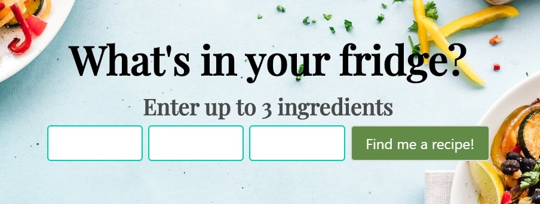
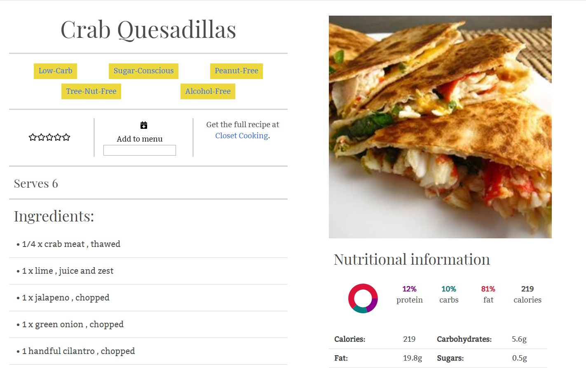
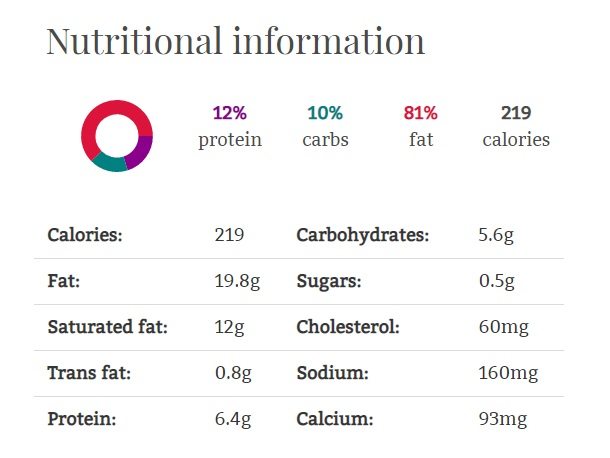
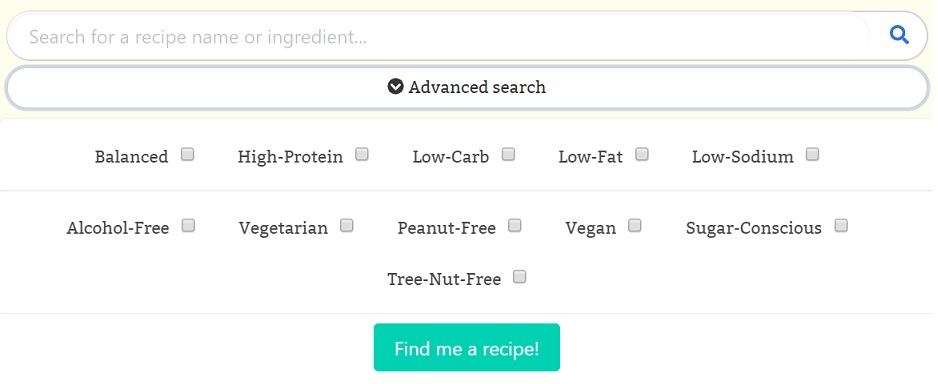
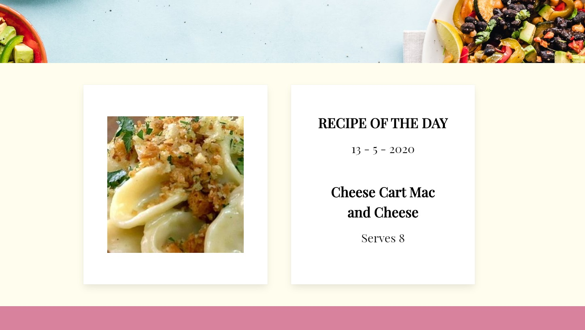

###  General Assembly, Software Engineering Immersive

# project-4

## Recipedia
by [Emma Hobday](https://emmahobday.github.io/) and [Denise Cheung](https://denisecheung3.github.io/).

Fridge half-full and need inspiration? Recipedia lets users input ingredients they've got and suggests recipes for them. You can browse, search and filter recipes using a range of advanced search features and, if you find something you like, add it to your personal meal planner. If you're missing any ingredients, add them to your personal shopping list and check them off once you've got them. Rate recipies out of five, and you'll receive personalised recipe suggestions based on your tastes.

Check it out [here](http://recipedia84.herokuapp.com/).


This is my fourth and final project with General Assembly's Software Engineering Immersive course. This was a paired project, completed in one week. All the project planning was collaborative - we came up with a really detailed plan that we both felt very excited about. We pair-programmed the first day, setting up project from scratch and designing the backend models together. From there, we started each day with a paired stand-up, during which we decided what features we'd each work on individually that day. We pair-programmed some features, and collaborated throughout each day with problem solving and helping to debug our code. 


## Table of contents

* [Brief](#brief) 
* [Technology used](#tech) 
* [Approach](#approach) 
    * [Creating our database](#database)
    * [Backend models](#models)
    * [Browse Recipies](#browse)
    * [What's in your fridge?](#fridge)
    * [View a recipe](single)
      * [Health tags](#healthtags)
      * [Nutritional information](#nutri)
    * [Search and filter recipies](#search)
      * [Advanced search](#advanced)
    * [Recipe of the Day](#rotd)
	* [Register/login](#register) 
	* [Additional features for logged-in users](#additional)	
	  * [Rate recipes](#rate)	
	  * [Menu planner](#menu)
	  * [Shopping list](#shopping)
*  [Challenges](#challenges)
*  [Lessons learned](#learning)
*  [Future development ideas](#future)

<a name="brief"></a>
## Brief
* Choose to work solo or in a team
* Build a full-stack application by making your own backend and your own front-end
* Use a Python Django API using Django REST Framework to serve your data from a Postgres database
* Consume your API with a separate front-end built with React
* Be a complete product which most likely means multiple relationships and CRUD functionality for at least a couple of models
* Have a visually impressive design to kick your portfolio up a notch and have something to wow future clients & employers.
* Be deployed online so it’s publicly accessible.

<a name="tech"></a>
## Technologies Used

* JavaScript (ES6)
* React.js
* Python
* Django
* PostgreSQL
* SCSS
* HTML
* Webpack
* React-scheduler
* Moment
* Heroku
* Git and GitHub
* Bulma
* Google Fonts

<a name="approach"></a>
## Approach

We started by building our backend models. We planned and created these very carefully, ensuring that they'd work for all our planned functionality. We then created our MVP - a database of recipies, accessed with advanced search and filter functions. We then worked on our stretch goals - the meal planner, the shopping list and the recipe ratings. Towards the end of the project, we focused on styling.

<a name="database"></a>
## Creating our database
We decided to get our recipe data from a public API, Edamam. This saved us the job of sourcing a substantial amount of recipies independently, and we were still able to have some control over how the data was organised in our PostgreSQL database. After examining the API documentation, we decided which fields we wanted to store. We wanted to add an additional field called 'main protein', which we would use to categorise recipes - we did this by using the search term used in the API request. So, we sent a GET request with the search term 'chicken' for 50 recipies, and stored these in our database with the field 'mainProtein' as 'chicken'. Note: 'main protein' ended up being a bit of a misnomer, because we included other food groups like potato, rice, etc.

We automated the population of our database using Python. We created a python file for each mainProtein source we wanted in a 'management' folder, which contained the following code:

```
class Command(BaseCommand):
    def handle(self, *args, **options): 
        def get_recipe_info():
            api_url = f'{api_url_base}?q=beans&app_id={app_id}&app_key={app_key}&from=0&to=50'
            response = requests.get(api_url, headers=headers)
            if response.status_code == 200:
                return json.loads(response.content.decode('utf-8'))
            else:
                return None


        recipes = get_recipe_info()
        protein = recipes['q']
        print(protein)
        for hit in recipes['hits']:
            print(hit['recipe']['label'])
            createRecipe = Recipe.objects.create(
                dish_name = hit['recipe']['label'],
                main_protein = protein,
                image = hit['recipe']['image'],
                source = hit['recipe']['source'],
                instructions_url = hit['recipe']['url'],
                servings = hit['recipe']['yield'],
                diet_Labels = hit['recipe']['dietLabels'],
                health_Labels = hit['recipe']['healthLabels'],
                ingredients_lines = hit['recipe']['ingredientLines'],
                ingredients = hit['recipe']['ingredients'],
                calories = math.ceil(hit['recipe']['calories']),
                fat = hit['recipe']['totalNutrients'].get('FAT', {}).get('quantity'),
                fat_unit = hit['recipe']['totalNutrients'].get('FAT', {}).get('unit'),
                sat_fat = hit['recipe']['totalNutrients'].get('FASAT', {}).get('quantity'),
                sat_fat_unit = hit['recipe']['totalNutrients'].get('FASAT', {}).get('unit'),
                trans_fat  = hit['recipe']['totalNutrients'].get('FATRN', {}).get('quantity'),
                trans_fat_unit = hit['recipe']['totalNutrients'].get('FATRN', {}).get('unit'),
                carbs = hit['recipe']['totalNutrients'].get('CHOCDF', {}).get('quantity'),
                carbs_unit = hit['recipe']['totalNutrients'].get('CHOCDF', {}).get('unit'),
                sugars = hit['recipe']['totalNutrients'].get('SUGAR', {}).get('quantity'),
                sugars_unit = hit['recipe']['totalNutrients'].get('SUGAR', {}).get('unit'),
                protein = hit['recipe']['totalNutrients'].get('PROCNT', {}).get('quantity'),
                protein_unit = hit['recipe']['totalNutrients'].get('PROCNT', {}).get('unit'),
                cholesterol = hit['recipe']['totalNutrients'].get('CHOLE', {}).get('quantity'),
                cholesterol_unit = hit['recipe']['totalNutrients'].get('CHOLE', {}).get('unit'),
                sodium = hit['recipe']['totalNutrients'].get('NA', {}).get('quantity'),
                sodium_unit = hit['recipe']['totalNutrients'].get('NA', {}).get('unit'),
                calcium = hit['recipe']['totalNutrients'].get('CA', {}).get('quantity'),
                calcium_unit = hit['recipe']['totalNutrients'].get('CA', {}).get('unit')
            )
```
 We replaced the query `q=` on the fourth line with the name of each main protein in it's file. Running this file then made the request, and populated our database with the precise fields we wanted. 
 
 <a name="models"></a>
## Backend Models

We needed several models: User, recipe, healthlabel, rating, shopping_list, recipe_to_buy_for, meal_plan_recipe. We started by making these. We had sketched a wireframe of how our models would interact. Our central models are User and recipe.

**Users**
Initially, we planned to hold more information on the User model, such as 'healthLabels' and 'fiveStarRecipes'. This seemed to make the most sense to us conceptually, since we'd want to retrieve this information for a user frequently. Django provides an inbuilt User authentication system, which we modified with a customer User model. However, we ran into issues with adding manyToMany fields on a custom user - we think this is something to do with Django's user model package that we weren't able to override. Therefore, we had to restructure our data a little, removing these fields from the User model and putting them within the related models - for example, our health_labels model contains a ManyToManyField, called ‘user’, with the related name ‘health_labels’. Therefore, our custom User model ended up being very straightforward, with only the field 'image', a character field to allow users to link a profile picture with a URL:

```
from django.contrib.auth.models import AbstractUser

class User(AbstractUser):
    image = models.CharField(max_length=500, blank=True, null=True)
```

We created a User serializer, which is used for login and register. I'll talk about how we did this in the Register section. We also created a PopulateUserSerializer which has all the desired fields, including health_labels, and created a UserView in our `views.py` which returns users using the PopulateUserSerializer.

```
class PopulateUserSerializer(serializers.ModelSerializer):
    class Meta:
        model = User
        fields = ('id', 'username', 'image', 'health_labels', 'comments',)
```

```
class UserView(APIView):
  def get(self, request):
    users = User.objects.all()
    serialized_users = PopulateUserSerializer(users, many=True)
    return Response(serialized_users.data)
```

**Recipies**

Our recipe model specifies all the fields required in the database for each recipe. The ArrayField took a bit of debugging to get it working correctly, but we're glad we persevered, because using arrays for health_labels etc is ideal for managing the data in the way we wanted.

```
from django.contrib.postgres.fields import ArrayField

class Recipe(models.Model):
  dish_name = models.CharField(max_length=500, null=True)
  main_protein = models.CharField(max_length=100, null=True)
  image = models.CharField(max_length=5000, null=True)
  source = models.CharField(max_length=500, null=True)
  instructions_url = models.CharField(max_length=500, null=True)
  servings = models.IntegerField(null=True)
  diet_Labels = ArrayField(models.CharField(max_length=50, blank=True, null=True))
  health_Labels = ArrayField(models.CharField(max_length=50, blank=True, null=True))
  ingredients_lines = ArrayField(models.CharField(max_length=50, blank=True, null=True))
  ingredients = ArrayField(models.CharField(max_length=50, blank=True, null=True))
  calories = models.FloatField(null=True)
  fat = models.FloatField(null=True)
  fat_unit = models.CharField(max_length= 100, null=True)
  sat_fat = models.FloatField(null=True)
  sat_fat_unit = models.CharField(max_length= 100, null=True)
  trans_fat = models.FloatField(null=True)
  trans_fat_unit = models.CharField(max_length= 100, null=True)
  carbs = models.FloatField(null=True)
  carbs_unit = models.CharField(max_length= 100, null=True)
  sugars = models.FloatField(null=True)
  sugars_unit = models.CharField(max_length= 100, null=True)
  protein = models.FloatField(null=True)
  protein_unit = models.CharField(max_length= 100, null=True)
  cholesterol = models.FloatField(null=True)
  cholesterol_unit= models.CharField(max_length= 100, null=True)
  sodium = models.FloatField(null=True)
  sodium_unit = models.CharField(max_length= 100, null=True)
  calcium = models.FloatField(null=True)
  calcium_unit = models.CharField(max_length= 100, null=True)

  def __str__(self):
      return self.dish_name
```

We needed two serializers for recipies: basic and detailed. The basic recipe serializer is used whenever we are returning list views - a list of recipes that match a given criteria. The detailed serializer contains all fields, and is used when we need to return a single recipe. The detailed serializer is more complex because we also include the rating the user has given the recipe, if indeed they have:

```
class BasicRecipeSerializer(serializers.ModelSerializer):
    class Meta:
        model = Recipe
        fields = ('id', 'dish_name', 'main_protein', 'image', 'source', 'instructions_url',
                  'servings', 'ingredients_lines', 'diet_Labels', 'health_Labels')


class DetailedRecipeSerializer(serializers.ModelSerializer):
    rating = serializers.SerializerMethodField()

    class Meta:
        model = Recipe
        fields = ('id', 'dish_name', 'main_protein', 'image', 'source', 'instructions_url', 'servings', 'diet_Labels',
                  'health_Labels', 'ingredients_lines', 'ingredients', 'calories', 'fat', 'fat_unit', 'sat_fat', 'sat_fat_unit',
                  'trans_fat', 'trans_fat_unit', 'carbs', 'carbs_unit', 'sugars', 'sugars_unit', 'protein', 'protein_unit',
                  'cholesterol', 'cholesterol_unit', 'sodium', 'sodium_unit', 'calcium', 'calcium_unit', 'rating')

    def get_rating(self, obj):
        user = self.context["request"].user
        print(user.is_authenticated)
        if user.is_authenticated:  # check if user is logged in
            user_rating = obj.ratings.filter(user=user).first()
            print(user_rating)
            if user_rating:  # if user logged in but never rated, rating field will be null
                return user_rating.rating_num
        return None  # if user isn't logged in rating field will be null
```

Our `views.py` for recipies include many different views for the different search methods we created. We used pagination to provide 40 search results per search - necessary since our database contains over 1000 recipes. The basic recipe list view and detail view are simply:

```
class AllRecipesPagination(PageNumberPagination):
    page_size = 40
    page_size_query_param = 'page_size'
    max_page_size = 40


class AllRecipesListView(ListCreateAPIView):
    queryset = Recipe.objects.all()
    serializer_class = BasicRecipeSerializer
    pagination_class = AllRecipesPagination

    def get(self, request):
        recipes = self.paginate_queryset(Recipe.objects.all())
        serializer = BasicRecipeSerializer(recipes, many=True)
        return self.get_paginated_response(serializer.data)


class RecipeDetailView(RetrieveUpdateDestroyAPIView):
    queryset = Recipe.objects.all()
    serializer_class = DetailedRecipeSerializer
```


<a name="browse"></a>
## Browse recipies

Our main page to browse recipes is accessed through 'find a recipe' on the navbar. This page contains a div for each main protein in our database, and a selection of recipies for each category are displayed using Bulma cards. These divs can be scrolled sideways for browsing, with a link to 'see more' if a user wants to view a greater range of recipes in this category.

INSERT GIF HERE

The scrolling div was achieved simply with CSS like so:

```
.scroll {
  overflow-y: hidden;
  overflow-x: scroll;
}
```

When this page loads, the front-end makes a request to the API. I built this component using React hooks. Because the data is paginated, I decided to make a separate API request for each category, rather than requesting all recipes, because otherwise we wouldn't be guaranteed to receive data for each category - plus, it seemed like a needless quantity of data to send over. I added an extra item to each array - a 'cross' image with the name 'see more', which was added to the end of each array - this had the id `section/${protein}`, so that rather than navigating to a recipe on click, as the recipe cards do, this would navigate to a page displaying more recipies in this category.

Originally, I achieved the desired effect only by writing out a separate API request for each category. My first attempt at refactoring this was to create an array of main proteins, and loop through this array, making API GET requests. However, this didn't work, because of asynch issues, so I needed to use promises to ensure I didn't throw errors. Getting this to work was a little fiddly. My solution was to use`Promise.all()` to set the returned data in state only once all the data had been returned.

```
  const proteins = ['chicken', 'salmon', 'pasta', 'beef', 'prawn', 'lamb', 'cheese', 'tuna', 'tofu', 'salad', 'scallop', 'pork', 'egg', 'potato', 'rice', 'mussels', 'beans', 'cod', 'crab', 'falafel']

useEffect(() => {
    const promises = []
    const finalArray = []
    proteins.forEach(protein => {
      promises.push(
        fetch(`/api/main/recipes/type/summary/${protein}`)
          .then(resp => resp.json())
          .then(resp => {
              finalArray.push(resp.results.concat({ 'id': `section/${protein}`, 'image': 'https://upload.wikimedia.org/wikipedia/commons/thumb/9/9e/Plus_symbol.svg/1200px-Plus_symbol.svg.png', 'dish_name': 'See more' }))
          }))
    })
    Promise.all(promises)
      .then(() => {
        setRecipes(finalArray)
      })
  }, [])
```

I had to reconsider how I stored this data in state in light of the format the data was returned in:

`  const [recipes, setRecipes] = useState([[{ main_protein: '' }]])`

I then mapped over the array of recipes in the return. One minor issue I encountered with this is that the order in which the categories are listed on the page changes every time, presumably depending on the order in which the response is received from the API. I couldn't find a way to control this without hard-coding the divs in the return, rather than mapping over them - in the end, for our site, the order isn't actually important because there's no hierarchy in the categories, so this didn't worry me too much.

On the backend, requests to the url used in `useEffect()` above use the `MainProteinSummaryView`. This returns 10 results that have a main protein that matches this request. I wrote this code using Django's filter queries.

```
class MainProteinSummaryView(ListCreateAPIView):
    serializer_class = BasicRecipeSerializer
    pagination_class = AllRecipesPagination

    def get(self, request, query):
        recipes = self.paginate_queryset(
            Recipe.objects.filter(main_protein__iexact=query)[:10])
        serializer = BasicRecipeSerializer(recipes, many=True)
        return self.get_paginated_response(serializer.data)
```


<a name="fridge"></a>
## What's in your fridge?



This feature sits prominently on our front page, and is a hook into more advanced recipe searching. Users can input up to three ingredients and they are given a selection of recipes that include these ingredients. 

I decided to conduct the search on the backend, as running a filter on data using Django filter queries seemed fairly straightforward, and this also means that only necessary data is sent over from the frontend to the backend. In addition, because the data is paginated, we'd need to request every page of data and search it to ensure the whole database had been searched.

My strategy was to include the search terms in the URL call to the API, joined by '&', and I then wrote a view that separates out the search terms, and filters using them as separate terms. The terms are set to an empty string if the user supplies less than three.

```
class FridgeRecipeView(ListCreateAPIView):
    serializer_class = BasicRecipeSerializer
    pagination_class = AllRecipesPagination

    def get(self, request, query):
        if query.count('&') == 2:
            query1 = query.split('&')[0]
            query2 = query.split('&')[1]
            query3 = query.split('&')[2]
        elif query.count('&') == 1:
            query1 = query.split('&')[0]
            query2 = query.split('&')[1]
            query3 = ''
        else:
            query1 = query
            query2 = ''
            query3 = ''

        recipes = self.paginate_queryset(Recipe.objects.filter(
            ingredients_lines__icontains=query1
        ).filter(
            ingredients_lines__icontains=query2
        ).filter(
            ingredients_lines__icontains=query3
        ))
        serializer = BasicRecipeSerializer(recipes, many=True)
        return self.get_paginated_response(serializer.data)
```
This was my first experience of writing this kind of logic in Python, and of using Django queryset filter methods. This solution avoided any errors if there are less than three search terms, but isn't very elegant - once I've had more practice with Python and Django, I have no doubt that I can find a more efficient solution!

The search results are displayed on the frontend on a search results page, using the `SearchResults` component. The data is simply mapped over on Bulma cards. The search results page also contains a `SearchBar` component at the top of the page, enabling the user to make further searches if necessary. Text at the top of the page also displays what the user searched for, and the total number of results:

INSERT PIC HERE


<a name="single"></a>
## View a recipe

When a user selects a recipe, they are taken to a page which displays the full information about this recipe.



The front-end makes a request to our API for the detailed recipe data, using the recipe id taken from props: 

```
const id = props.match.params.id

axios.get(`/api/main/recipe/${id}`)
        .then(resp => {
          console.log(resp)
          setSingleRecipeData(resp.data)
        })
```

The backend then requests the RecipeDetailView of this recipe:

`path('recipe/<int:pk>/', RecipeDetailView.as_view())`

```
class RecipeDetailView(RetrieveUpdateDestroyAPIView):
    queryset = Recipe.objects.all()
    serializer_class = DetailedRecipeSerializer
```

The single recipe page has a number of interesting features, depending on whether a user is logged in or not. Read more about these in [health tags](#healthtags), [nutritional information](#nutri), [rating](#rating), [menu planner](#menu) and [shopping list](#shopping).


<a name="healthtags"></a>
## Health tags
INSERT PIC HERE OF THE TAGS

The single recipe page displays the related `diet_labels` and `health_labels` as 'tags' underneath the recipe title. We decided to group these together, since the difference isn't important to the user. These serve as a summary of key health information to the user, and can also be clicked on to navigate to a page displaying all recipes of this type. 

INSERT PIC OF HEALTH TAG RESULTS

This required an extra, albeit simple, path and view in the backend:

```
    path('recipes/dietlabel/<str:query>', DietLabelRecipeView.as_view()),

```

```
class DietLabelRecipeView(ListCreateAPIView):
    serializer_class = BasicRecipeSerializer
    pagination_class = AllRecipesPagination

    def get(self, request, query):
        recipes = self.paginate_queryset(
            Recipe.objects.filter(Q(diet_Labels__icontains=query) | Q(health_Labels__icontains=query)))
        serializer = BasicRecipeSerializer(recipes, many=True)
        return self.get_paginated_response(serializer.data)
```

In addition, these health tags can optionally be selected as criteria in advanced searches. 

<a name="nutri"></a>
## Nutritional information



I displayed the nutritional information of each recipe using a Bulma table to make it easy to read, with each data point rounded to a sensible degree. I used a library called `DonutChart` to create a small donut chart to display the proportion of energy from fat, protein and carbohydrates - this was inspired partly by the way data is displayed in MyFitnessPal.

```
<DonutChart
              data={[
                { title: 'Protein', value: singleRecipeData.protein, color: '#8B008B' },
                { title: 'Carbs', value: singleRecipeData.carbs, color: '#008081' },
                { title: 'Fat', value: singleRecipeData.fat, color: '#DC143C' }
              ]}
              cx={60}
              cy={40}
              label={false}
              lengthAngle={360}
              lineWidth={40}
              paddingAngle={0}
              radius={40}
              rounded={false}
              startAngle={0}
              animate={true}
              animationDuration={3000}
              style={{
                height: '80px'
              }}
              viewBoxSize={[
                1,
                1
              ]}
            />
```

The DonutChart presented a few challenges - I hadn't used SVG before, and it took quite a bit of tinkering to get the size and position of the chart to look as I'd like. When I initially changed the size of the chart, I ended up with a huge left-size margin, and had to fiddle with cx, cy, viewBoxSize and radius to get the right result. I also added a subtle animation when the chart loads - although I rather think this is lost, since the chart renders fairly low down the page, so most users will need to scroll to see it, by which time the animation is over! 

<a name="search"></a>
## Search and filter recipies

Users can search for recipes on the main recipe page. There is a search bar, which takes text input, and an advanced search button which offers more detailed search criteria which the user can tick.

Initially I wrote code to search by searchbar text only. Inspired by other APIs I'd used, I decided to send the search terms through to the API by including them in the URL. So, on the front-end, when the user types into the bar it is set in state:

'onChange={() => setQuery(event.target.value)}'

These search terms are then appended to the end of the URL in the api request. I removed the space between words and replaced them with '&' so the backend could recognise where each search term begins and ends. 

```
const searchTerms = `${query.split(' ').join('&')}$${dietLabels.join('&')}$${healthLabels.join('&')}`
```

On submit, the user navigates to a page which contains the `searchterms` in the URL (e.g. http://recipedia84.herokuapp.com/#/recipes/search/avocado&halloumi)

```
		<Link
                to={{
                  pathname: `/recipes/search/${searchTerms}`,
                  state: {
                    query: query,
                    searchTerms: searchTerms
                  }
                }}
                
              ><span className='search-icon' onClick={() => setHidden(true)}><FontAwesomeIcon icon={faSearch} /></span> </Link>
```

Our router recognises that any URL that follows the pattern `/recipes/search/` should load the SearchResults component:

`<Route exact path={'/recipes/search/:query'} component={SearchResults} />`

This component then makes the API call based on this query:

```
 const { query } = useParams()
 
 useEffect(() => {
    fetch(`/api/main/recipes/search/${query}?`)
      .then(resp => resp.json())
      .then(resp => {
        setDisplaySearchResults(resp.results)
      })
    return () => console.log('Unmounting component')
  }, [query])
```

and the results are displayed, as in other components. The frontend displays the user's search query and the number of results:

```
 {query && <h1>You searched for "{queryString}" - {displaySearchResults.length} results</h1>}

```

On the backend, this URL pattern in the GET request uses the view `AllRecipeSearchList`. This view takes the query from the URL, creates an array of terms by splitting the string at each '&', then for each term in this array, creates the Django search term required (e.g.Q(ingredients_lines__icontains=term) | Q(dish_name__icontains=term)), and adds these terms to the array `queryterms`. The database is then filtered by all of these search terms.

Unlike the 'What's in your fridge?' search, which was limited to three search terms, this takes as many search terms as the user inputs.

```
class AllRecipeSearchList(ListCreateAPIView):
  serializer_class = BasicRecipeSerializer
  pagination_class = AllRecipesPagination 

  def get(self, request, query): 
    termsArray = query.split('&')
    queryTerms = []

    for term in termsArray:
        queryTerms.append(Q(ingredients_lines__icontains=term) | Q(dish_name__icontains=term))

    recipes = self.paginate_queryset(Recipe.objects.filter(*queryTerms))

    serializer = BasicRecipeSerializer(recipes, many=True)
    return self.get_paginated_response(serializer.data)
```
The field lookup query `icontains` means a case-insensitive search, and in Django, more complex queries using OR statements require you to use Q objects.

The most challenging part of this was working out how to filter the database by all the parameters in `queryTerms`. The solution - `(Recipe.objects.filter(*queryTerms))` is really straightforward, using `*` to pass in a variable number of terms. 

<a name="advanced"></a>
## Advanced search

Users can conduct more advanced search by including health_labels and diet_labels as filters, in addition to search terms.



The initial challenge was deciding how to send this information through to the backend. If I simply added them to the search terms with another '&', and added the diet_label and health_label fields to the list of those to be filtered by in the backend, the data might not be always right - for example, a user might request recipies with the label 'low-fat', and they would be returned any recipe that had 'low-fat' in the ingredients list (e.g. low fat yoghurt), even if the recipe doesn't have that tag. I needed a way to separate out the diet_labels and the health_labels from the search terms.

My solution was to use a `$` to separate the three aspects of a search query: search terms, health_labels and diet_labels. Within these aspects, the `&` could still be used to chain multiple terms or labels together. For example, a request for recipes that contain chicken and garlic, are high protein, peanut-free and sugar-conscious would generate this search term `chicken&garlic$High-Protein$Peanut-Free&Sugar-Conscious` using this code:

```
const searchTerms = `${query.split(' ').join('&')}$${dietLabels.join('&')}$${healthLabels.join('&')}`
```

This search term is used in the URL as with the previous search. In our backend views, I wrote the following view to decode the search terms and run the correct search:

```
class AdvancedSearchList(ListCreateAPIView):
    serializer_class = BasicRecipeSerializer
    pagination_class = AllRecipesPagination

    def get(self, request, query):

        print(query)
        categoryArray = query.split('$')

        wordsArray = categoryArray[0].split('&')
        dietLabelsArray = categoryArray[1].split('&')
        healthLabelsArray = categoryArray[2].split('&')

        queryTerms = []

        for term in wordsArray:
            queryTerms.append(Q(ingredients_lines__icontains=term) | Q(dish_name__icontains=term))

        for term in dietLabelsArray:
            queryTerms.append(Q(diet_Labels__icontains=term))

        for term in healthLabelsArray:
            queryTerms.append(Q(health_Labels__icontains=term))

        recipes = self.paginate_queryset(Recipe.objects.filter(*queryTerms))

        serializer = BasicRecipeSerializer(recipes, many=True)
        return self.get_paginated_response(serializer.data)
```

This splits the query initially at the `$` to create an array/List with three elements. The first element (categoryArray[0]) will be the search terms - these are split at the `&` and assigned to the variable `wordsArray`. The same is done for the `dietLabelsArray` and `healthLabelsArray`. I then used three separate loops to ensure the correct fields are searched for each array. The logic is otherwise the same as for the previous search.


<a name="rotd"></a>
## Recipe of the day

Each day, a new 'Recipe of the day' is generated and displayed on the homepage. 



This presented an interesting problem: we wanted to generate a new recipe each day, but it should remain in place for the whole day, and be the same for all users. Previously, we've used Math.random() to generate a random ID, but simply generating a random recipe every time the component loads wouldn't fit the bill.

My solution was to use the date as a starting point for selecting the ID for the recipe, because this would mean it'd automatically change every day. 

First, I created a variable `date` which is a number - the sum total of today's year, month, and date.

```
const today = new Date()
const date = today.getFullYear() + (today.getMonth() + 1) + today.getDate()
```

I then wrote a function than turns this number into a number between 1 and 1000 (which makes it a suitable recipe ID). I wanted this to return a very different number each day, since the recipe IDs are ordered consecutively by main protein - it wouldn't be very exciting to have several months of chicken recipes, for example. I did a little bit of data modelling to test my solution out, and this seems to do the job, although I'd like to look at this really carefully in the future and hopefully find an even better way:

```
  function todaysRecipe() {
    dailyRecipe = date
    while (dailyRecipe > 1000) {
      dailyRecipe = Math.ceil(dailyRecipe / ((dailyRecipe % 15) + 1))
    }
    return dailyRecipe
  }
```

Once the recipe ID has been selected, it simply renders in the middle section of our homepage, along with the title, and today's date.


<a name="register"></a>
## Register/login


<a name="additional"></a>
## Additional features for logged-in users


<a name="rate"></a>
## Rate recipies


<a name="menu"></a>
## Menu planner


<a name="shopping"></a>
## Shopping list


<a name="challenges"></a>
## Challenges


<a name="learning"></a>
## Lessons learned

This process was a really good opportunity to develop my Python skills. We'd only had a brief introduction to Python before starting this project, as opposed to JavaScript, which we've spent lots of time building our skills with. I was able to apply my JS knowledge to pick up the Python required relatively quickly, but in terms of general approach to problem solving, I found myself initially trying to just translate JS into Python, because I immediately thought of how I'd solve it in JS. The longer I spent fiddling with the Python code, the better able I was to devise solutions that utilised Python more efficiently.

Using new things - hooks, backend search, libraries - minimal pie chart, intro to SVG

Focus on creating a really well designed feature rather than loads of shite ones. So a really robust search function, ux that flows, considering user routes, clear error handling

Bulma navbar - the struggles of making a component look a certain way (centred logo) when it’s not designed for that.


<a name="future"></a>
## Future development ideas

Remove duplicate entries maybe using set()
User profile
Set vegetarian etc, and return ONLY search results that fit that, although that would rule out certain sections of ‘all recipes’. Is that what people want?
CSS - set up default colours, make generic classes e.g. main-title etc so you can apply these all over the site, rather than making specifics for each component
submitting the advanced search - a last minute change means that typing and pressing enter no longer submits the searchbar text, but opens up the 'advanced' bit.
